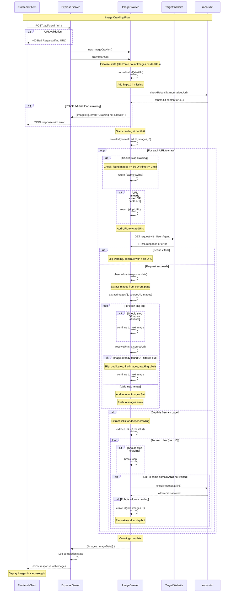

# Image Crawler Server - Sequence Diagram



## Key Flow Points

### 1. Request Validation
- Server validates incoming POST request has URL parameter
- Returns 400 error if URL missing

### 2. Crawler Initialization
- Creates new ImageCrawler instance per request
- Resets state: startTime, foundImages Set, visitedUrls Set

### 3. URL Normalization & Robots Check
- Adds https:// prefix if protocol missing
- Fetches and parses robots.txt for domain
- Stops crawling if robots.txt disallows

### 4. Recursive Crawling (Max Depth: 1)
- **Depth 0**: Main page crawling + link extraction
- **Depth 1**: Internal link crawling (same domain only)

### 5. Termination Conditions
- **Image limit**: 50 images maximum
- **Time limit**: 3 minutes maximum
- **Depth limit**: 2 levels maximum
- **Domain restriction**: Same domain only

### 6. Image Filtering Pipeline
- Skip images without src attribute
- Skip duplicate URLs (Set-based deduplication)
- Skip tiny images (< 50x50 pixels)
- Skip tracking/analytics images (URL pattern matching)

### 7. Error Handling
- Network failures: Log warning, continue crawling
- Invalid URLs: Skip silently
- Missing robots.txt: Assume crawling allowed
- Timeout errors: Handled by axios timeout (10s)

### 8. Response Format
```json
{
  "images": [
    {
      "url": "https://example.com/image.jpg",
      "sourceUrl": "https://example.com/page",
      "alt": "Image description"
    }
  ],
  "error": "Optional error message"
}
```